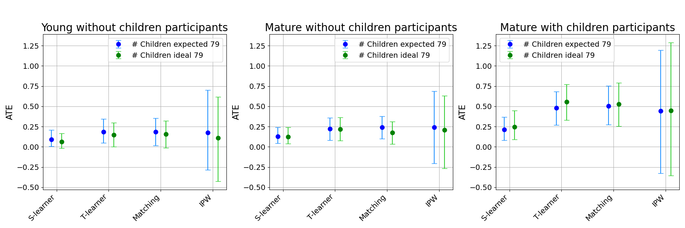

<h1 align="center"> Causal Inference Project </h1> 
<h3 align="center">  Causal Inference 097400 – Spring 2024 </h3>
<h5 align="center"> Technion – Israel Institute of Technology </h5>

  

    <a href="https://www.linkedin.com/in/itamar-harel-3245a82b2/"> Itamar Harel </a> •
    <a href="https://www.linkedin.com/in/edan-kinderman-1320611b8/"> Edan Kinderman </a>
  

## Summary

In this project, we explored the following causal questions: how does a person's expectations, and opinions about the ideal number of children in a family, influence the actual number of children they eventually have.
We pre-processed and analyzed features from the NLSY79 dataset [[1]](#ref1), focusing on three distinct groups: young responders without children at the time of the first survey, mature responders without children, and mature responders with children. 

We applied multiple causal inference methods to estimate the effects of the treatments from both binary and continuous [[2]](#ref2) perspectives. 
Our results align with our expectations, indicating that expecting a large number of children or considering a large number as ideal influences candidates to have more children in the future. 
These effects appear strongest in the "mature with children" group, possibly because their expectations and opinions about children are more realistic and well-considered. 
However, from our current results, it is challenging to determine if one treatment has a greater effect than the other.

For more details, see our project report [[3]](#ref3).

 

    <figure>
        
        <figcaption style="text-align: center;">Estimated average treatment effects (ATE) per group. Confidence intervals (95%) were calculated with 1000 bootstrap samples.</figcaption>
    </figure>

 

    <figure>
        
        <figcaption style="text-align: center;">Average dose–response function for each of our participant groups, with 95% confidence intervals.</figcaption>
    </figure>

 

## References and credits

* <a id="ref1">[[1]](https://www.nlsinfo.org/)</a> National Longitudinal Surveys, U.S. Bureau of Labor Statistics.
* <a id="ref2">[[2]](https://www.math.mcgill.ca/dstephens/PSMMA/Articles/HIrano-Imbens-2004.pdf)</a> "The propensity score with continuous treatments", Hirano, Keisuke and W. Imbens, Guido. 2004.
* <a id="ref3">[[3]](https://github.com/itamar-github/causal_inference_project/blob/master/Causal_Inference___Project.pdf)</a> Our prject report, Itamar Harel, Edan Kinderman.

